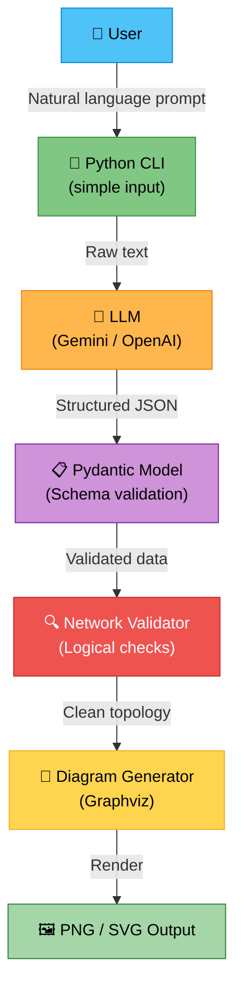
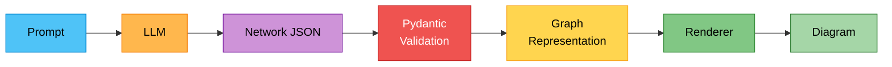
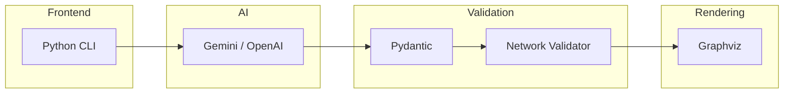

# Cisco AI Assistant

> AI-powered network diagram generator — describe your network in plain English, get validated topology diagrams.

---

## Global Architecture



---

## Workflow



---

## Component Details

| Component             | Role                                                        |
| --------------------- | ----------------------------------------------------------- |
| **Python CLI**        | Accepts natural-language descriptions from the user         |
| **LLM**              | Parses the prompt and produces a structured network JSON    |
| **Pydantic Model**   | Validates the JSON against a strict schema                  |
| **Network Validator** | Runs logical checks (duplicate IPs, orphan nodes, loops…)   |
| **Diagram Generator** | Converts the validated topology into a visual graph         |
| **Output**            | Renders the final diagram as PNG or SVG via Graphviz        |

---

## Getting Started

```bash
# Clone the repository
git clone https://github.com/<your-org>/cisco-ai-assistant.git
cd cisco-ai-assistant

# Install dependencies
pip install -r requirements.txt

# Run the assistant
python main.py
```

---

## Tech Stack



---

## License

MIT       
